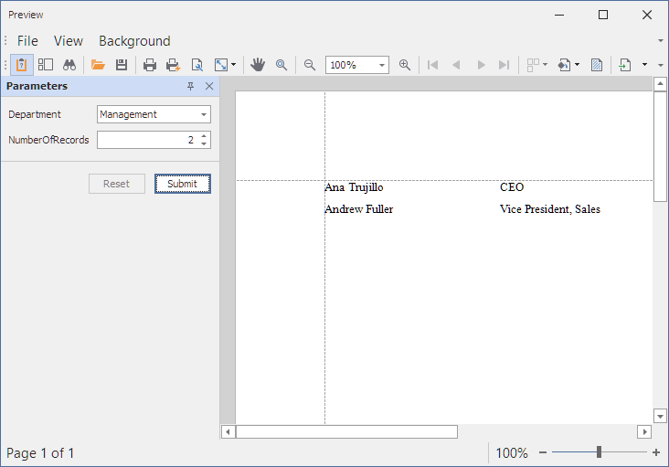

<!-- default badges list -->

<!-- default badges end -->
# How to Bind a Report to an Object Data Source at Runtime

This example creates a simple report in code, creates an [ObjectDataSource](https://docs.devexpress.com/CoreLibraries/DevExpress.DataAccess.ObjectBinding.ObjectDataSource) instance, fills it with data, and binds the report to the object data source.

## Files to Look At

* [ReportHelper.cs](CS/WindowsFormsApp1/ReportHelper.cs)(VB:[ReportHelper.vb](VB/WindowsFormsApp1/ReportHelper.vb))
* [Form1.cs](CS/WindowsFormsApp1/Form1.cs)(VB:[Form1.vb](VB/WindowsFormsApp1/Form1.vb))

## Documentation

- [Bind Reports to Data](https://docs.devexpress.com/XtraReports/15034/detailed-guide-to-devexpress-reporting/bind-reports-to-data)
- [Use Object Data Source](https://docs.devexpress.com/CoreLibraries/403658/devexpress-data-library/data-sources/use-object-data-source)
- [Create a Report in Code](https://docs.devexpress.com/XtraReports/115726/detailed-guide-to-devexpress-reporting/reporting-api/create-reports-in-code)

